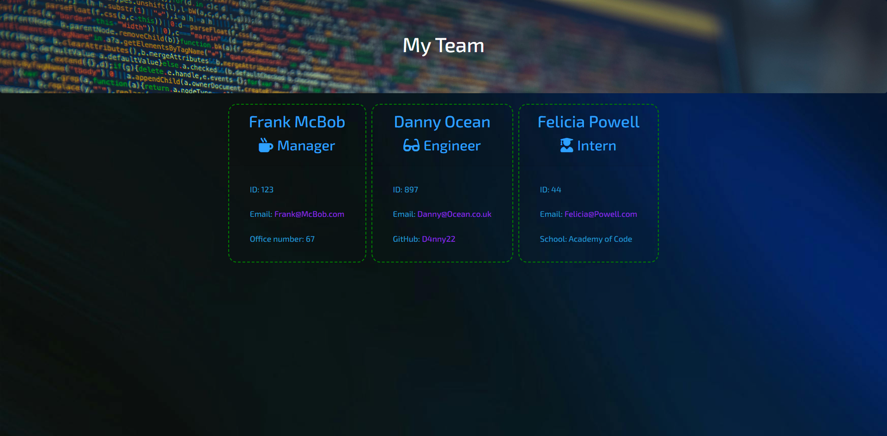

# Team-Profile-Generator
A webpage generator that displays employee info

I created an app that enables users to dynamically generate a html page with styling that displays employee information, including Manager, Engineers and Interns. The project uses the command line interface, node and inquirer. 

This solves the issue of displaying different kinds of employee information via inquirer prompts which are both recursive and conditional dependent upon the employee type. 

DEPLOY LINK
https://xanlefee.github.io/Team-Profile-Generator-1/

## Installation

Download the repo and open in VS Code. 

Ensure the relevant dependencies are in the file: inquirer, jest and node. (Else these can be accessed by typing 'npm init -y, npm i inquirer, npm i jest seperately in the command line)

## Usage 

For running tests, navigate to the test file inside the tests folder, open in integrated terminal and type 'npm test' to run the tests.

To generate the html, open the command line by opening index.js in integrated terminal. type 'node index.js' and answer the questions. Navigate to output/team.html and open live server.

## Credits

Starter content provided by Edex.

## License
MIT License

Copyright (c) 2023 Xanthe E. Horner

Permission is hereby granted, free of charge, to any person obtaining a copy
of this software and associated documentation files (the "Software"), to deal
in the Software without restriction, including without limitation the rights
to use, copy, modify, merge, publish, distribute, sublicense, and/or sell
copies of the Software, and to permit persons to whom the Software is
furnished to do so, subject to the following conditions:

The above copyright notice and this permission notice shall be included in all
copies or substantial portions of the Software.

THE SOFTWARE IS PROVIDED "AS IS", WITHOUT WARRANTY OF ANY KIND, EXPRESS OR
IMPLIED, INCLUDING BUT NOT LIMITED TO THE WARRANTIES OF MERCHANTABILITY,
FITNESS FOR A PARTICULAR PURPOSE AND NONINFRINGEMENT. IN NO EVENT SHALL THE
AUTHORS OR COPYRIGHT HOLDERS BE LIABLE FOR ANY CLAIM, DAMAGES OR OTHER
LIABILITY, WHETHER IN AN ACTION OF CONTRACT, TORT OR OTHERWISE, ARISING FROM,
OUT OF OR IN CONNECTION WITH THE SOFTWARE OR THE USE OR OTHER DEALINGS IN THE
SOFTWARE.

